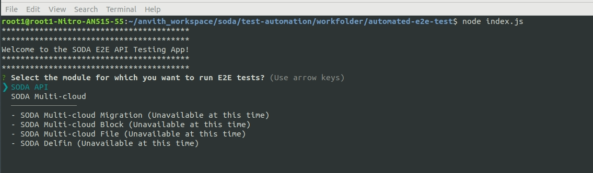

# Welcome to the SODA Automated E2E Test Suite
Automated E2E tests for SODA Project APIs using Postman collections, global variables and the [Newman](https://www.npmjs.com/package/newman) collection runner.  
The [newman-reporter-htmlextra](https://www.npmjs.com/package/newman-reporter-htmlextra) is a HTML reporter that has been extended to include the separation of the iteration runs.  
This reporter comes with a dashboard style summary landing page and a set of different tabs which contain the detailed request information. There are also a few optional [configuration flags available](https://www.npmjs.com/package/newman-reporter-htmlextra#user-content-usage), to tailor the final report in a number of different ways.


## Pre-requisites
---  
To run Newman, ensure that you have Node.js >= v10. [Install Node.js via package manager](https://nodejs.org/en/download/package-manager/).  
You can install different versions of NodeJS and maintain different versions using `nvm - Node Version Manager`. Instructions on how to install `nvm` can be found [here](https://github.com/nvm-sh/nvm)  


## Installation
--- 
1. Clone the repository  

    ```
    git clone https://github.com/sodafoundation/qa/.git
    ```

2. To Install `newman` and the reporter `newman-reporter-htmlextra`  run the following:

    ```
    cd api-testing/automated-e2e-test
    npm install
    ```


## Configuration
---  
### **Configure newman and newman-reporter-html-extra**  
---  
We use Newman as a library to run the collection.

The options are configured in the `optionsObj`


```JavaScript
var optionsObj = {
    // Location of the Postman Collection
    collection: require('./collections/<file_name.json>'),
    // Location of the Postman Global Variables
    globals: require('./env_vars/SODA_Globals.postman_globals.json'), 
    // Location of the Postman environment variables to be used
    environment: require('./env_vars/<file_name.json>'), 
    // Location of the Iteration Data to be used to run the tests.
    iterationData: ('./iteration_data/<file_name.json>'), 
    // Reporters to be enabled. We use the default cli reporter and also the custom htmlextra reporter.
    reporters: ['htmlextra','cli'], 
    // Configuration for the newman-reporter-htmlextra
    reporter: { 
        htmlextra: {
            logs: true,
            // The browser title of the generated report.
            browserTitle: "SODA Multicloud E2E Test report",
            // The document title of the generated report.
            title: "SODA Multicloud E2E Test report",
            //Hide sensitive headers from the request
            skipHeaders: "X-Auth-Token",
            // Hide request body for these requests in the report            
            hideRequestBody: ["Register Backend", "Register Backend Invalid Credentials"],
            // Hide response body for these requests in the report
            hideResponseBody: ["Register Backend", "Register Backend Invalid Credentials"],
            // Hide these global variables from the report
            skipGlobalVars: ["authToken"],
        }
    },
    insecure: true, // allow self-signed certs, required in postman too,
    delayRequest: 2000, // Set the delay between every request
    timeout: 180000  // set time out,
}
newman.run(optionsObj).on('start', function (err, args) { // on start of run, log to console
    console.log('Running E2E tests for SODA multicloud ...');
}).on('done', function (err, summary) {
    if (err || summary.error) {
        console.error('collection run encountered an error.');
    }
    else {
        console.log('collection run completed.');
    }
});
```

### Configure Iteration Data
---  
To run the E2E tests with different data we use the `iteration_data.json` file.
This file contains an array of objects, each of which holds a set of inputs that can be used per iteration.

```JSON
//This is a sample. You can populate with actual values.
{
        "name": "backend_aws",
        "type": "aws-s3",
        "region": "ap-south-1",
        "endpoint": "s3.ap-south-1.amazonaws.com",
        "security": "<Enter_Valid_Secret_Key>",
        "access": "<Enter_Valid_Access_Key>",
        "bucketName": "isabelatestawsbucket",
        "folderName":"sample_aws_folder"
},
```
**Note:** ***Please replace the values for `security` and `access` keys with the actual Secret Key and Access key provided by the Cloud backend.***


## Usage
---  
To run the collection :

```
npm run e2e
```

OR

```
node index.js
```
The SODA E2E API Testing app will show you options to select the module for which the API tests have to be run.
The current options available are `SODA API` and `SODA Multi-cloud`.  

The configuration will be set accordingly.  




## Import and Edit Requests and Tests
---  
You can import the Postman collection and the global and environment variables JSON file in Postman.  
The collection uses global variables, environment variables, iteration data and the pre-request scripts and post request tests to enable the user to run tests with different inputs and input data.  
Tests can be edited and added using the Postman desktop application.

After editing the requests and/or scripts and the variables they can be exported using Postman.

### For more information:  
|Task|Link|Examples|
|----|----|--------|
|Writing Scripts in Postman|[Link](https://learning.postman.com/docs/writing-scripts/intro-to-scripts/)||
|Writing Pre-request Scripts|[Link](https://learning.postman.com/docs/writing-scripts/pre-request-scripts/)||
|Writing test sripts in Postman|[Link](https://learning.postman.com/docs/writing-scripts/test-scripts/)|[Examples](https://learning.postman.com/docs/writing-scripts/script-references/test-examples/)||
|Dynamic Variables | [Link](https://learning.postman.com/docs/writing-scripts/script-references/variables-list/)||
|Postman JavaScript Reference|[Link](https://learning.postman.com/docs/writing-scripts/script-references/postman-sandbox-api-reference/)||
|Using Variables|[Link](https://learning.postman.com/docs/sending-requests/variables/)||  


<br />

## View Reports
---  
CLI reporter is enabled by default when Newman is used as a CLI, you do not need to specifically provide the same as part of reporters option. However, enabling one or more of the other reporters will result in no CLI output.  

We have enabled the `newman-reporter-htmlextra`, A Newman HTML reporter that has been extended to include the separation of the iteration runs so these are no longer aggregated together and also some additional handlebars helpers to enable users to create better custom templates.

This reporter comes with a dashboard style summary landing page and a set of different tabs which contain the detailed request information. There are also a few optional configuration flags available, to tailor the final report in a number of different ways.

The reports are generated in the `/reports` folder.


